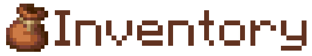
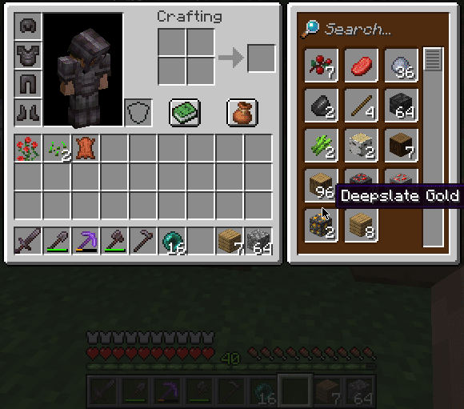

# BundleInv

  

This mod as the name suggests combines the idea of the Bundle and inventory expansion, to improve the inventory of Minecraft.

It adds a whole secondary Bundle Inventory.  
This Bundle Inventory acts very similar to the Bundle, as it has a max amount of inventory space, but no limit on Item types.  
So you can store many types of blocks and items in that inventory and not worry about slots running out too fast.

## Storage & Stacking
The stacks require the same space as in bundles.  
The inventory has a limited Bundle Slot Capacity and items take up those slots based on their max-stack amount.
* Items that stack to 64 take up 1 slot per item.
* Items that stack to 16 take up 4 slots per item.
* Items that do not stack take up 64 slots per item.

So basically the same as the Bundle, but with a lot more slots at once.

## Small Size
In order to keep the inventory manageable the GUI for the Bundle Inventory takes up as little space as possible and leaves space for the status effect icons on smaller screens.  
It automatically hides when opening the Recipe Book.  

## Functionality
It is designed to integrate with the primary inventory and supports basic functionalities.  
You can drag and drop items in and out of the secondary and into the primary inventory, and the other way around.  
For example you can Left-click to store one item, and Right-click to store whole cursor stack.

### Hover Guide
When hovering over the BundleInv with an Item on your cursor, it'll show you the existing items already in the inventory.    
Or a Bundle icon in case there is nothing in it yet.  
That way you know exactly how much you already have of the item without searching for it.  

## Search
Search items in the Bundle Inventory using the search bar on top.  
This takes the display name and lore of the item into account, so you can look for your renamed items.

## Pick-Block
Pick-Block (`Middle-Click on Block`) puts the picked block into the hotbar and selects it. 
If the item already exists inside the Hotbar, it selects it and tries to replenish it with items from the Bundle Inventory.  
In case no such item is inside the Hotbar, then it takes the maximum amount of that item from the Bundle Inventory and puts 
it into the Hotbar, wherever is space, otherwise swaps items from the hotbar with the item from the Bundle Inventory.  

## Planned & WIP Features

### Quick move
#### Secondary Inventory
`Shift-Click`: secondary -> primary  
`Ctrl-Shift-Click`: secondary -> hotbar / upper-inventory

#### Primary Inventory  
`Ctrl-Shift-Click`: primary -> secondary (Since shift-click would move it into the hotbar)

#### Upper-Inventory
`Ctrl-Shift-Click`: upper inventory -> secondary (Since shift-click would move it into primary)

## Possible Future Features
- Pin items, that are always shown first in the list.
- Prioritise secondary inventory (or single slots?) when picking up items.